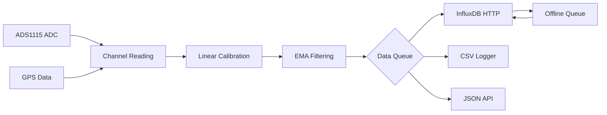

# Instrumentation System

A **YAML-configured, multi-threaded instrumentation system** for battery monitoring and sensor data acquisition. Features real-time ADC measurements, GPS integration, InfluxDB data transmission with offline resilience, and comprehensive YAML-based configuration.

## 🚀 Key Features

- **4-Channel ADC Monitoring**: ADS1115 16-bit ADC with configurable gain settings
- **GPS Integration**: Real-time positioning via gpsd daemon
- **Battery State Monitoring**: Coulomb counting with state-of-charge calculation  
- **Network Resilience**: Offline queuing with compression and automatic retry
- **YAML Configuration**: Single-file configuration with environment variable support
- **Thread-Safe Pipeline**: Producer-consumer pattern for non-blocking data collection
- **Multiple Output Formats**: InfluxDB Line Protocol + CSV logging + JSON API

## 📋 System Requirements

### Hardware
- **I2C Bus**: For ADS1115 ADC communication (requires root access)
- **ADS1115 ADC**: 16-bit, 4-channel analog-to-digital converter
- **GPS (Optional)**: Via gpsd daemon on localhost:2947

### Software Dependencies

Install required packages on Debian/Ubuntu:
```bash
sudo apt-get update
sudo apt-get install cmake build-essential libcurl4-openssl-dev \
                     libyaml-dev libgps-dev zlib1g-dev
```

**Dependencies:**
- `cmake` (≥3.0) - Build system
- `build-essential` - GCC compiler and make
- `libcurl4-openssl-dev` - HTTP client for InfluxDB
- `libyaml-dev` - YAML configuration parsing
- `libgps-dev` - GPS functionality via gpsd
- `zlib1g-dev` - Compression for offline queue

## 🔧 Building

### Standard Build (Application + Tests)
```bash
mkdir build && cd build
cmake ..
make
```

### Application Only
```bash
mkdir build && cd build
cmake .. -DBUILD_TESTS=OFF
make
```

**Build Outputs:**
- `instrumentation` - Main application
- `yaml-test` - YAML parsing tests
- `yaml-validation-test` - Configuration validation
- `integration-test` - End-to-end testing
- `debug-yaml` - Configuration debugging utility

## ⚙️ Configuration

### YAML Configuration Files
All system configuration is managed through YAML files in the `configurations/` directory:

- `config_bike.yaml` - Bicycle/marine battery monitoring
- `config_arariboia.yaml` - Custom sensor configuration  
- `config_blank.yaml` - Template for new configurations

### Configuration Structure
```yaml
metadata:
  version: "1.0"
  calibration_date: "2024-08-10"

hardware:
  i2c_bus: "/dev/i2c-1"
  ads1115_address: 0x48

system:
  main_loop_interval_ms: 1000
  data_send_interval_ms: 10000

channels:
  - id: "battery_voltage"
    pin: 0
    gain: "GAIN_4096MV"
    slope: 0.00125
    offset: 0.0
    filter_alpha: 0.1

influxdb:
  url: "https://your-influxdb.com"
  token: "${INFLUXDB_TOKEN}"      # Environment variable
  org: "${INFLUXDB_ORG}"
  bucket: "${INFLUXDB_BUCKET}"

logging:
  csv_enabled: true
  csv_directory: "./logs"
  max_file_size_mb: 100

battery:
  capacity_ah: 100
  efficiency: 0.95

gps:
  enabled: true
  min_satellites: 4

network:
  socket_server_port: 2025
  offline_queue_enabled: true
```

### Environment Variables
Export required credentials before running:
```bash
export INFLUXDB_TOKEN="your-influxdb-api-token"
export INFLUXDB_ORG="your-organization"
export INFLUXDB_BUCKET="your-bucket"

# Optional: Custom InfluxDB URL
export INFLUXDB_URL="https://your-influxdb-instance.com"
```

## 🏃‍♂️ Running

### Basic Execution
```bash
# Requires root for I2C access
sudo ./build/instrumentation configurations/config_bike.yaml
```

### Testing Configuration
Before deployment, validate your YAML configuration:
```bash
# Test YAML parsing
./build/yaml-test configurations/config_bike.yaml

# Comprehensive validation
./build/yaml-validation-test configurations/config_bike.yaml

# Integration test
./build/integration-test
```

### Runtime Features
- **Interactive Calibration**: Type `CAL0`, `CAL1`, `CAL2`, or `CAL3` to calibrate channels
- **Graceful Shutdown**: `Ctrl+C` for clean termination with data preservation
- **Live Monitoring**: JSON API server on configurable port (default: 2025)
- **Status Monitoring**: Check logs and offline queue status

## 📊 Data Pipeline



**Data Flow:**
1. **Collection**: 4-channel ADC + GPS via MeasurementCoordinator
2. **Processing**: Linear calibration + EMA filtering  
3. **Queuing**: Thread-safe DataQueue for async transmission
4. **Output**: InfluxDB Line Protocol, CSV files, JSON API
5. **Resilience**: Offline queue with compression for network outages

## 🔧 Hardware Setup

### ADS1115 ADC Wiring
```
ADS1115    →    Device
VDD        →    3.3V or 5V
GND        →    Ground  
SCL        →    I2C Clock (GPIO 3 on Raspberry Pi)
SDA        →    I2C Data (GPIO 2 on Raspberry Pi)
A0-A3      →    Analog sensor inputs
```

### Sensor Types Supported
- **Hall-effect current sensors** (±100A typical range)
- **Voltage dividers** for battery voltage monitoring
- **Linear sensors** with configurable calibration
- **Differential measurements** between channel pairs

### I2C Configuration
Enable I2C on your system:
```bash
# Raspberry Pi
sudo raspi-config
# Enable I2C in Interfacing Options

# Check I2C devices
sudo i2cdetect -y 1
```

## 🎛️ Calibration

### Interactive Calibration
While running, calibrate any channel:
1. Type `CAL0` (for channel A0) and press Enter
2. Apply known physical measurement (e.g., 10.5A current)
3. Enter the actual measurement value when prompted
4. System calculates and applies new slope/offset
5. Calibration automatically saved to configuration

### Manual Calibration
Edit YAML configuration directly:
```yaml
channels:
  - id: "current_sensor"
    pin: 0
    slope: 0.066    # Calculated: (Reading2-Reading1)/(Value2-Value1)
    offset: -2.048  # Calculated: Reading1 - slope*Value1
```

**Linear Calibration Formula:**
```
calibrated_value = slope × raw_adc_value + offset
```

## 🔍 Monitoring & Troubleshooting

### Live Monitoring
Connect to JSON API server:
```bash
curl http://localhost:2025/
```

### Log Files
- **CSV Logs**: `./logs/*.csv` - Raw sensor data with timestamps
- **System Logs**: Check console output for errors and status
- **Offline Queue**: Automatic backup during network outages

### Common Issues

**"Permission denied" on I2C bus:**
```bash
# Must run as root
sudo ./instrumentation configurations/config_bike.yaml
```

**"ADS1115 device not found":**
```bash
# Check I2C connection
sudo i2cdetect -y 1
# Should show device at configured address (default 0x48)
```

**"INFLUXDB_TOKEN not set":**
```bash
# Export required environment variables
export INFLUXDB_TOKEN="your-token"
export INFLUXDB_ORG="your-org"
export INFLUXDB_BUCKET="your-bucket"
```

**GPS not working:**
```bash
# Check gpsd status
sudo systemctl status gpsd
# Should be running on localhost:2947
```

**Measurements appear incorrect:**
- Verify sensor wiring and power supply
- Check gain settings in YAML configuration  
- Ensure current flows in correct direction (arrow on sensor)
- Run calibration procedure for affected channels

## 🏗️ Architecture

### System Overview
```
┌─────────────────────┐
│ ApplicationManager  │  ← YAML-configured orchestrator
├─────────────────────┤
│ ConfigYAML         │  ← Configuration parser & validator
├─────────────────────┤ 
│ MeasurementCoordinator │ ← Data collection coordination
├─────────────────────┤
│ HardwareManager    │  ← I2C & GPS abstraction
├─────────────────────┤
│ DataPublisher      │  ← InfluxDB Line Protocol
│ CsvLogger          │  ← Local file logging
│ BatteryMonitor     │  ← SoC via coulomb counting
├─────────────────────┤
│ Sender (threaded)   │  ← HTTP transmission + retry
│ DataQueue          │  ← Thread-safe messaging
│ OfflineQueue       │  ← Network failure resilience
└─────────────────────┘
```

### Threading Model
- **Main Thread**: Sensor reading, GPS updates, system coordination
- **Sender Thread**: Background HTTP transmission with retry logic
- **Thread Safety**: Mutex-protected queues, atomic flag operations
- **Signal Handling**: Clean shutdown preserves data integrity and queue state

## 🤝 Contributing

### Development Workflow
```bash
# Build and test
cmake .. && make

# Validate configuration changes
./build/yaml-validation-test configurations/config_bike.yaml

# Run full test suite  
./build/yaml-test configurations/config_bike.yaml
./build/integration-test

# Deploy with new configuration
sudo ./build/instrumentation configurations/config_custom.yaml
```

### Code Style
- **Guard clauses** for reduced nesting
- **Structured error handling** with detailed error codes
- **Memory safety** with proper bounds checking
- **Resource cleanup** following RAII patterns

## 📝 License

This project is designed for **battery monitoring and sensor data acquisition** in marine, automotive, and industrial applications.

## 📞 Support

For configuration questions, hardware setup, or troubleshooting:
1. Check YAML configuration with validation tools
2. Review log files for error details  
3. Verify hardware connections and I2C device detection
4. Test with known-good configuration files